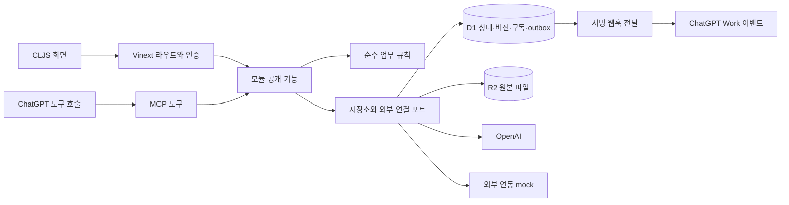

# 명문가 시스템 설계

작성일: 2026-10-09 · 상태: 구현 전 설계 · 기준: [해커톤 PRD](../prd/hackathon-prd.md)

## 구성 원칙

웹·MCP·이벤트가 같은 업무 규칙과 데이터에 접근하는 모듈러 모놀리스를 구성한다. 해커톤의 외부 연동은 교체 가능한 어댑터로 두고, 실제 OpenAI 호출과 mock 결과의 출처를 남긴다. 마이크로서비스나 별도 메시지 브로커는 기본 구성에 넣지 않는다.

## 런타임과 폴더

`service/`를 애플리케이션 루트로 삼는다. `service/app/`에는 Vinext의 라우트·인증·조립 코드를 두고, 화면은 `service/ui/`의 CLJS로 작성한다. CLJS는 shadow-cljs의 ESM 출력으로 연결한다. 브라우저와 서버 빌드를 나눠 서버 비밀과 저장소 접근 코드가 클라이언트 번들에 들어가지 않게 한다.

화면은 UIx와 React를 사용한다. Vinext가 요구하는 라우트·React 경계와 Sites 연동만 얇은 TypeScript/TSX로 작성한다. 업무 규칙을 TS와 CLJS 양쪽에 중복 구현하지 않는다. React는 호스트의 단일 인스턴스를 사용하고 개발·배포 빌드의 ESM import 경계를 확인한다.

Sites의 서버 실행 환경은 Cloudflare Workers다. JVM은 CLJS 빌드 때만 필요하며 운영 서버에 올리지 않는다. Worker 코드에서 로컬 파일시스템·네이티브 Node 모듈·상주 프로세스·raw TCP를 전제하지 않는다. Java·Node 실행은 machine-environment 스킬과 프로젝트 런타임 선언을 따른다.

| 위치 | 책임 |
| --- | --- |
| `service/app/` | 라우팅, 요청 identity, 모듈 조립, HTTP 응답 변환 |
| `service/ui/` | CLJS 화면·사용자 입력·조회 상태. 서버 권한 판정을 대체하지 않음 |
| `service/modules/` | 아래 모듈의 공개 기능, 순수 업무 규칙, 모듈 소유 저장소 어댑터 |
| `service/connectors/mcp/` | tools·events·subscriptions. 업무 규칙은 모듈 기능을 호출 |
| `service/connectors/skills/` | 향후 서비스 이용 SKILL.md. 현재는 [사용 계약](mcp-and-skills.md#skills)만 정의 |
| `service/.openai/hosting.json` | 향후 Sites identity·D1·R2·MCP capability 선언. 비밀값 제외 |

위 런타임 파일·디렉터리 중 기존 폴더에 없는 것은 향후 구현 위치다. 현재 package.json·shadow-cljs 설정·빌드 명령은 생성하지 않는다. 패키지 버전은 첫 구현에서 Sites starter와 호환되는 버전으로 잠그고 lockfile을 유지한다.

## 모듈과 공개 기능

공개 기능은 함수 호출이며 모듈마다 HTTP 서버를 만들지 않는다. 다른 모듈의 내부 namespace·테이블·저장소를 직접 사용하지 않는다. 순환 참조가 필요한 흐름은 `app`의 작업 조립 계층에서 공개 기능을 연결한다.

| 모듈 | 소유하는 정보 | 공개 기능의 범위 |
| --- | --- | --- |
| `organization` | 종중·명부·계정 연결·역할·접근 범위 | 명부 등록·조회, 계정 연결 검토, 권한 확인·변경·인수인계 |
| `assets` | 토지·계약·자료 스냅샷·비교·확인 기록 | 자산·계약 조회·기록, 기준 자료 등록, 비교·변경 상세 조회 |
| `accounting` | 회비·거래·증빙 연결·결산 | 거래 기록·정정, 기간별 집계·결산 자료 생성 |
| `meetings` | 회의·안건·대상자·통지·참석·위임·표결·동의 | 총회 준비, 안내 기록, 참석·표결·특정 버전 동의 기록 |
| `documents` | 원본·추출 근거·문서 버전·검토·공유·내보내기 | 업로드 완료, 원문 조회, 초안·정정본 저장, 검토·권한별 내보내기 |
| `ai-workflows` | AI 작업·입력 버전·모델·사용량·결과 상태 | 전사·구조화·검색·초안·다음 작업 분류·추천 설명 |
| `legal-support` | 준비 업무·법률 자료 메타데이터·점검 결과·전문가 후보·상담 준비 | 설립 준비 정리, 근거 확인, 문제 점검, 조건별 후보 추천·전달자료 준비 |

DB·파일·현재 시각·ID 생성·AI·발송은 포트로 주입한다. 업무 규칙은 값과 상태를 받아 새 상태·검증 결과·발생할 이벤트를 반환한다. 감사 로그와 outbox 저장은 작업 커밋에 포함한다. 작은 함수마다 추상화를 추가하지 않고 시간·네트워크·영속 상태 같은 변동 경계에만 포트를 둔다.

## 공통 데이터와 호출 계약

| 정보 | 최소 계약 |
| --- | --- |
| 요청 문맥 | 서버에서 확인한 `principal_id`, `clan_id`, 권한·자료 범위. 클라이언트가 보내는 역할값은 신뢰하지 않음 |
| 업무 객체 | 안정적인 ID·소속 종중·버전·생성/수정 시각·작성자. 시간은 UTC로 저장하고 한국어 화면은 Asia/Seoul로 표시 |
| 출처 | `source_kind`, 원본 ID·버전, 페이지/구간/시간 위치, `observed_at`, 자료 자체의 기준일, `is_demo` |
| 명령 | 변경 대상, `expected_version`, 재시도용 `idempotency_key`. 서버가 권한을 확인한 뒤 적용 |
| 결과 | 성공값 또는 구분 가능한 `invalid_input`, `forbidden`, `not_found`, `version_conflict`, `external_unavailable`, `needs_review` |
| 근거 | 문서 ID·버전·원문 위치. 답변·추출·추천·점검 결과에서 다시 조회 가능 |

CLJS 내부는 map과 값 타입을 사용하고 HTTP/MCP 경계에서 JSON으로 변환한다. 권한 없는 객체의 존재 여부도 응답으로 노출하지 않는다. 긴 AI 작업은 작업 ID와 상태로 추적하고 클라이언트의 재전송으로 중복 생성하지 않는다.

`clan_id`는 멀티테넌시 경계다. 연결 자료도 같은 종중 소속인지 확인한다. 종중 안에서도 연락처·관계 자료·회의 검토 자료의 열람 범위를 분리하며, 검색에 전달할 파일과 PDF에 포함할 자료를 서버가 먼저 제한한다.

## 저장과 버전

D1에는 업무 객체·문서 메타데이터·AI 작업·감사 기록·구독·outbox를 저장한다. R2에는 원본·생성 PDF를 저장하고 파일을 제공할 때마다 열람 권한을 확인한다. 브라우저 저장소는 화면 설정만 맡는다. D1 migration은 스키마 변경에 사용하고 시연 seed는 별도로 넣는다.

화면에서 연결한 토지·계약·거래·회의는 동일한 저장 객체를 참조한다. 새로고침하거나 역할을 바꿔도 연결이 유지되어야 한다. 원 단위 금액은 안전한 정수로 검증하고 부동소수점 금액 계산을 하지 않는다. 회계 정정은 원거래와 정정 내역을 남긴다.

회의 대상자·안건·적용 규약은 당시 버전을 고정한다. 명부나 규약이 바뀌어도 과거 기록이 바뀌지 않는다. 문서 검토 상태는 `draft → in_review → internally_confirmed`이며, 반려는 사유와 함께 초안 작업으로 돌아간다. 확인 완료본의 변경은 새 `revision`을 만들어 다시 검토한다.

문서 해시·변경 이력은 같은 파일인지와 변경 여부를 확인하는 수단이다. 작성 내용의 진실성·공증을 보증하지 않는다. 이 설계는 운영자까지 포함한 불변 원장이나 외부 공증을 구현했다고 주장하지 않는다.

상태 변경·감사 기록·해당 outbox 항목은 원자적으로 저장한다. R2나 OpenAI처럼 같은 트랜잭션에 넣을 수 없는 결과는 작업 상태로 관리한다. 원본 업로드 실패·검색 색인 미완료를 정상 등록 완료로 숨기지 않는다.

## OpenAI 처리 흐름

| 작업 | 선택한 경로 | 결과와 확인 |
| --- | --- | --- |
| 녹음 전사 | OpenAI Audio Transcriptions, `whisper-1` 기본 | 한국어 전사와 지원되는 구간 정보. 화자·인명·금액의 확정은 담당자가 함 |
| 사진·문서 구조화 | Responses + `gpt-6-luna`, Structured Outputs | 문서 종류·필드·원문 위치·미확인 항목. 빈 값과 추측을 구분 |
| 근거 검색 | File Search + `gpt-6-luna` | 권한 범위의 문서·버전·인용, 근거 없음·상충 상태 |
| 초안·추천 설명 | Responses + `gpt-6-luna` | 확인된 기록과 후보 데이터에 근거한 초안. 없는 정보는 보완 항목 |
| 다음 작업 선택 | Decisions API + `gpt-6-luna`의 `choice` | `draft`, `request_information`, `expert_review` 중 제안. 법적 유효성·범죄 여부를 판정하지 않음 |

모델 선택은 제출서의 Luna·Whisper 계획을 구체화한 기본값이다. 서비스에서 비 OpenAI 모델로 조용히 대체하지 않는다. 원자료의 로컬 전사 도구 사용 이력은 인터뷰 자료의 이력이며 서비스 실행 스택이 아니다. [Luna 지원 기능](https://developers.openai.com/api/docs/models/gpt-6-luna), [전사 안내](https://developers.openai.com/api/docs/guides/speech-to-text), [Decisions](https://developers.openai.com/api/docs/guides/decisions).

처리 순서는 원본 등록 → 전사/구조화 → 필드 검토 → 권한 범위 색인 → 근거 검색 → 작업 제안 → 초안 → 담당자 확인이다. 단순 문서 조회에 모든 AI 단계를 반복하지 않는다. 문서 해시·입력 버전·작업 종류·모델·프롬프트 버전을 재사용 기준으로 삼되, 결과 재사용 전 현재 권한을 확인한다.

File Search는 종중별 자료 저장소를 분리하고 종중 내부 권한도 파일 메타데이터 필터로 좁힌다. 사용자가 보낸 필터를 그대로 쓰지 않는다. 색인된 권한 정보가 최신임을 보장하지 못하거나 필터가 허용된 파일 집합을 표현하지 못하면 요청을 보류한다. 반환 뒤 가리는 방식만으로 접근 통제를 구현하지 않는다. [메타데이터 필터](https://developers.openai.com/api/docs/guides/tools-file-search#metadata-filtering).

API의 거부·시간 초과·할당량 부족·스키마 오류는 실패 상태와 재시도 가능 여부를 남긴다. 데모 캐시를 선택하면 저장된 이전 결과라는 점을 표시한다. 단위 테스트의 가짜 응답을 실제 API 성공 기록으로 합산하지 않는다. 입력·출력 토큰, 지연 시간, 호출 ID를 기록하고 비용은 실제 사용량과 당시 요율로 산정한다.

## 설립·법률 확인·전문가 추천

설립 준비는 사용자가 원하는 업무, 종중의 현재 조직 상태, 보유한 규약·명부·대표자 자료, 토지 관련 요청을 먼저 정리한다. 문서 양식의 항목은 준비용 템플릿이며 법정 필수 서류로 단정하지 않는다. 미확정 값은 빈 항목과 확인 질문으로 남긴다.

법률 근거는 공식 URL, 법령 시행일 또는 판결 선고일, 조회일, 원문 버전을 함께 저장한다. 초기 자료는 PRD의 SRC-08이며 전체 종중 법령집을 확보한 것으로 표시하지 않는다. 해커톤에서는 확인한 공식 원문을 색인해 검색하고, 조회 기준일을 넘는 최신성은 보증하지 않는다. 법령·판례·개별 종중 규약·인터뷰 경험을 서로 다른 출처 유형으로 다룬다.

문제 점검은 참석 기록과 회의록의 불일치, 위임 자료 누락, 규약 버전 미확인, 소유자 표시 변화 등 **자료에서 찾을 수 있는 사항**을 대상으로 한다. 결과는 근거·누락 정보·확인할 질문·다음 작업 제안으로 구성한다. 근거가 없어 평가하지 못한 상태를 문제 없음으로 바꾸지 않는다.

추천은 법무사와 변호사 후보를 분리한다. 사용자가 정한 필수 조건(업무 분야, 지역/원격 허용, 상담 방식, 예산 상한)을 확인된 후보 필드에 적용한 뒤, 남은 후보를 선호 조건 충족 개수와 안정적인 ID 순으로 정렬해 최대 3명을 보여준다. 비용 미상 후보는 예산 상한 충족 후보로 넣지 않고 별도의 확인 필요 목록에 둔다. 조건 충족 후보가 없으면 빈 결과와 조정 가능한 조건을 제시한다.

AI는 서버가 추린 후보 ID와 확인된 프로필만 받아 추천 이유·차이·미확인 항목을 설명한다. 새 후보, 확인하지 않은 전문성·경력·승소 가능성·비용을 만들지 않는다. 해커톤의 모든 후보에는 가상 프로필 표시를 유지한다. 사용자가 후보와 공유 자료를 선택하면 상담 준비 기록을 저장하고 접수 어댑터는 mock 결과를 반환한다.

## 총회·알림·동의

총회 준비는 대상자 스냅샷과 안건·자료 버전을 만든다. 발송 요청·전달 결과·읽음·참석 응답은 별도 기록이다. 전화 응답에는 실제 종원, 입력한 담당자, 방식·시각·근거를 남긴다. 기술 지원이나 단순 대리 입력을 법적 위임으로 바꾸지 않는다.

동의 요청은 안건 또는 결정문 버전, 대상 명부 항목, 응답 기한을 고정한다. 응답은 `pending`, `agree`, `disagree`, `withdrawn`으로 기록하고 이전 응답 이력을 유지한다. 기한 후 입력은 `closed`로 거부하며, 변경이 필요하면 새 요청을 만든다. 문서가 수정되면 이전 동의를 새 버전에 승계하지 않는다.

인앱 알림과 본인 응답 저장은 실제로 구현한다. 외부 푸시·문자 어댑터는 `mock_delivered`·`mock_failed`를 반환하며 기기 수신 완료로 표시하지 않는다. 인증·명부 연결·현재 권한 확인 후 응답을 받는다. 알림의 재전송은 같은 동의 요청을 참조하고 응답 수를 늘리지 않는다. 동의 응답과 총회 표결 기록은 서로 다른 데이터다.

## 토지 자료 비교와 이벤트

`assets`는 기준·후속 자료와 비교 결과를 저장한다. 동일한 출처 종류와 필지의 비교 가능한 필드만 비교한다. K-GeoP 값과 등기사항증명서를 아무 설명 없이 같은 연속 데이터로 합치지 않는다. 문서 비교를 지원하지 못하는 형식은 미확인으로 남긴다.

기준값 최초 등록, 파일 중복, 비교 필드가 같은 자료, 수집 실패는 변경 이벤트를 만들지 않는다. 비교 가능한 후속 자료의 필드 변화가 저장될 때 `asset.record.updated`를 만든다. `changed_fields`에 소유자 변화가 있는지 구분하며 자료상 변화의 법적 의미는 검토 상태로 남긴다. [전달 계약](mcp-and-skills.md#event).

공개 조회의 과거 이력은 조회일에 새로 발생한 사건이 아니다. 데모는 가상 후속 자료로 소유자 변화 과정을 보여주며 화면·이벤트·ChatGPT 요약까지 `is_demo`와 출처를 유지한다.

## 배포·외부 연결의 확인 경계

Sites starter의 build integration을 유지하고 D1·R2와 `mcp` capability를 선언한다. Sites가 처리하는 로그인·OAuth를 재구현하지 않는다. 서버가 받은 Site 사용자 ID를 계정 키로 사용하고 종중 소속·역할은 서비스에서 검사한다. API 키와 웹훅 비밀키는 브라우저·Git·호스팅 manifest에 넣지 않는다.

사이트는 처음 소유자 제한으로 배포한다. 빌드와 배포가 성공해도 실제 OpenAI 호출·MCP 도구·ChatGPT 이벤트 수신을 검증한 것으로 간주하지 않는다. 모델 접근, 플러그인 설치, Work Cloud와 callback 보안 요구의 지원 여부는 최종 연결 검증에서 별도로 기록한다.

현재 설계의 원격 연결·CLJS/Vinext 빌드 호환성은 실행 검증 전이다. 구현 중에는 단위 테스트와 빌드·정적 검사로 경계를 확인하며 전체 업무의 E2E는 [최종 게이트](testing.md#e2e-gate)를 통과한 뒤에만 실행한다. Sites 저장·identity·MCP 처리 방식은 구현 당시 설치된 Sites 스킬과 [공식 Sites 안내](https://learn.chatgpt.com/docs/sites)를 함께 확인한다.
